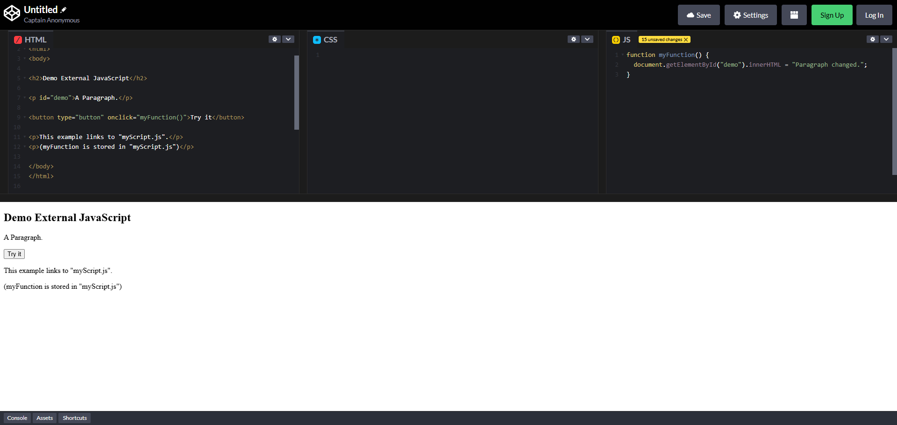
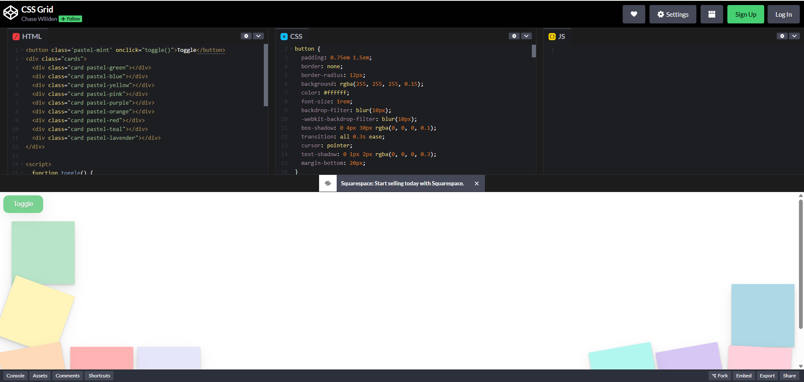

# Coding Tool: CodePen

Web developers often use html, css, and javascript. I already have a decent grasp on html and css, but I am not as familiar with javascript. Since I am teaching myself javascript, this has come in handy since the three go hand in hand. 

I was recently introduced to a really cool website: [CodePen](https://codepen.io/). This site allows you to code in html, css, and javascript simultaneously and immediately see what your code does.

The top part of the screen is your editor, divided into html, css, and javascript sections side by side. The bottom part of the screen shows the output. The following image shows a simple site I made while going through a w3 schools tutorial for javascript. The site is very simple, but shows how handy CodePen can be.

The next image is from an [example](https://codepen.io/chasewillden/pen/VYLPJxm) given to me by the person who introduced me to the site. Since we aren't using JavaScript in that class, that section remains empty, but otherwise shows a slightly more robust example of the uses for CodePen. This site organizes/disorganizes the boxes when you click the toggle button.

I think this tool will become a must use for me when it comes to the development of websites. I can imagine that there are cases when CodePen is a bit clunky for what I have in mind - like if I want to use multiple stylesheets or something like that - but even in those cases, I could use it as a quick proof of concept or testbed for different features. The ability it gives you to see all of your code side by side while simultaneously looking at a live example of how your code will execute seems like it will be invaluable.
