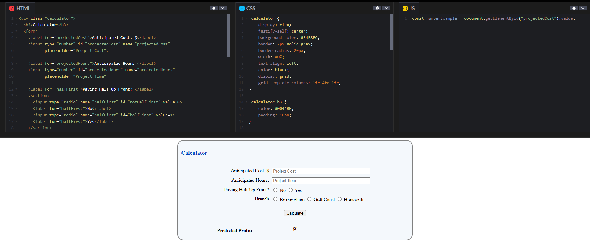
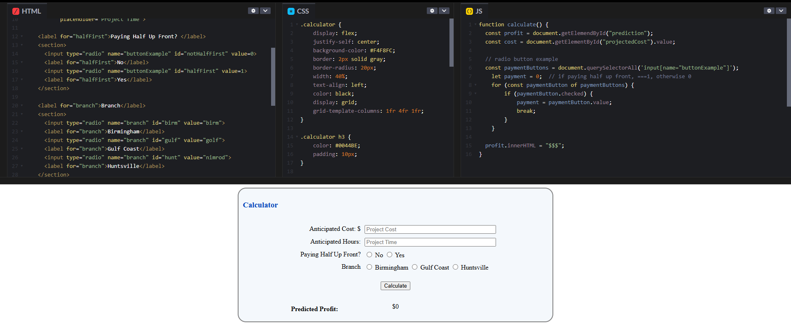

# Using Radio Buttons in JavaScript

There are many ways to get information from a user when making a website. JavaScript can come in particularly handy when handling user input. Most input types are fairly straightforward, like in the example below. Here we are getting the anticipated cost of a project from the user.



(examples created using [CodePen](https://codepen.io/pen/))

## Radio Buttons

Radio buttons are a bit trickier. Radio buttons are used when a single option needs to be selected from a list. In the example above, both the "Paying Half Up Front?" and "Branch" questions use radio buttons.

### HTML Set Up

Setting up the html is simple. Make an input with "type='radio'". All radio inputs with the same name property will be treated as a single radio question. The value property tells the site what each button should relay to your program.

```
  <input type="radio" name="buttonExample" id="notHalfFirst" value=0>
  <input type="radio" name="buttonExample" id="halfFirst" value=1> 
```

### Fixing the JavaScript

The problem comes when you move over to JavaScript. In the numerical example above, you can simply take the value and use it in your code. If you try to do the same thing with a radio button, it will always give you the value of the first option, no matter which option is selected by the user. This is because the code "getElementById" only returns the first matching thing it finds. Since all of the options are coded as seperate inputs, this way of getting user input will always ignore what the user wants. 

To get the value of a radio button, first you have to retrieve all of the input options. Then you can loop through them to figure out which option the user selected.

```
  const paymentButtons = document.querySelectorAll('input[name="buttonExample"]');
  let payment = 0;  // if paying half up front, ===1, otherwise 0
  for (const paymentButton of paymentButtons) {
      if (paymentButton.checked) {
          payment = paymentButton.value;
          break;
      }
  }
```

## Conclusion

They may be a bit more effort from a coding perspective, but radio buttons are a handy tool when getting categorical information from a webpage's users. Below is an updated example implementing what we've done above.


